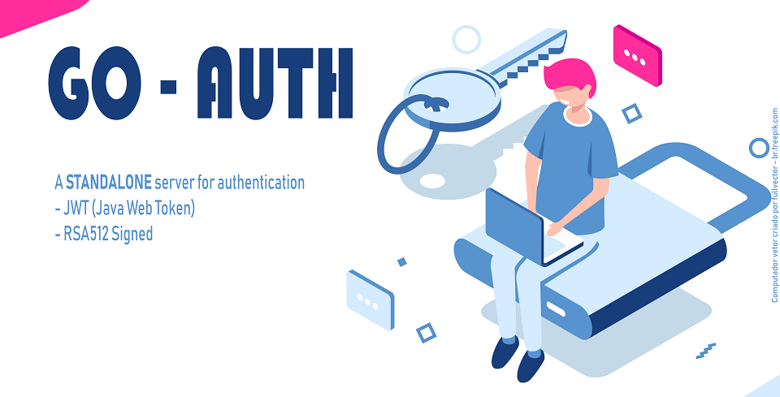

# Authentication System 

Everything still is too new, if you have any question please send me a message or open a issue.

## Goal

Java Web Token (JWT) generation authentication system to be consumed in calls through API Requests(AJAX) and / or session control (Cookies). The system will consist of 3 parts:

- [x] Server with authentication API
- [ ] Library for token validation and middleware implementation
- [ ] Dashboard area for user management and access log monitoring.

## Requirements

- Option of encrypt or not data stored (payload) in the token;

- Option between Bycript(default) or AES as signature encryption algorithm (signature);

- Cookies should be used as HttpOnly to mitigate Script Cross Site (XSS) attacks ¹;

- Create tokens with all standard  payload claims, mainly:

  - `aud`- Specifies a JWT audience
  - `iss`- Specifies JWT creator
  - `exp` - specify the time for JWT to expire
  - `iat` - specifies JWT creation timestamp

[1]: https://www.owasp.org/index.php/HttpOnly "OWASP HttpOnly"

## Technology chosen

- Programming language: Go lang
- Execution environment: Heroku;
- Databases: PostgreSQL;
- Libraries:
  - gorilla mux
  - ...

## Todo list

- [ ] Unity test of all system
- [ ] Delete RSA key files
- [ ] Config information via environment variables
- [ ] Heroku PostgreSQL integration
- [ ] Dashboard for user manager
- [ ] Code snippets for JQuery and Vue Js forms
- [ ] Port validation library to PHP (Save a legacy system)

## Database Model

## API

- Routes
  - `/api/login`
  - `/api/logout`

## Library

...
